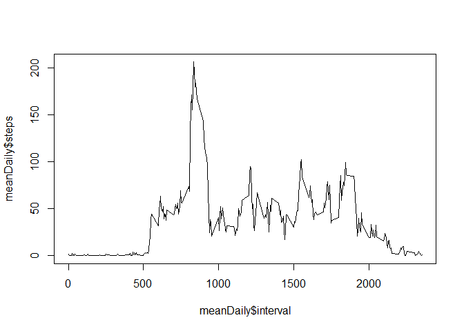

---
output:
  html_document:
    keep_md: yes
---
# Reproducible Research: Peer Assessment 1

## Loading and preprocessing the data

This is the r-code to load the data. 

```r
if(!file.exists("./activity.csv")){
        unzip("./activity.zip")
        ; 
}
activity<-read.csv("activity.csv")
```

This is the header of the data to give you an idea of what it looks like.

```r
head(activity)
```

```
##   steps       date interval
## 1    NA 2012-10-01        0
## 2    NA 2012-10-01        5
## 3    NA 2012-10-01       10
## 4    NA 2012-10-01       15
## 5    NA 2012-10-01       20
## 6    NA 2012-10-01       25
```


## What is the mean total number of steps taken per day?
Determining the total number of steps per day:

```r
totSteps<-aggregate(steps ~ date,activity,FUN=sum)
```

Generating a histogram of the total number of steps taken per day:


```r
library('ggplot2')
ggplot(totSteps, aes(x=steps)) + geom_histogram(binwidth = 1000)
```

 

The mean number of steps taken per day is:

```r
mean(totSteps$steps)
```

```
## [1] 10766
```

The median number of steps taken per day is:

```r
median(totSteps$steps)
```

```
## [1] 10765
```

## What is the average daily activity pattern?

Here I determine the average number of steps per interval.

```r
meanDaily<-aggregate(steps~interval,activity,FUN=mean)
```

This can be shown in a timeseries of the 5-minute interval (x-axis) and the average number of steps taken (y-axis):

```r
plot(meanDaily$interval,meanDaily$steps,type='l')
```

 

The 5-minute interval which contains the most steps, averaged over each day is:

```r
meanDaily$interval[which.max(meanDaily$steps)]
```

```
## [1] 835
```

## Imputing missing values

Total missing values in the dataset:

```r
sum(is.na(activity$steps))
```

```
## [1] 2304
```

I am replacing the NA-values with the average number (over all days) of steps taken during that specific interval. This chunk of code merges the original dataset with the dataset containing the average number of steps taken during an interval


```r
newest<-merge(activity,meanDaily,by='interval')
```
Here you can see what this set looks like:

```r
head(newest)
```

```
##   interval steps.x       date steps.y
## 1        0      NA 2012-10-01   1.717
## 2        0       0 2012-11-23   1.717
## 3        0       0 2012-10-28   1.717
## 4        0       0 2012-11-06   1.717
## 5        0       0 2012-11-24   1.717
## 6        0       0 2012-11-15   1.717
```

Next I will replace the NA values in the original dataset (steps.x) with the values from the meanDaily dataset (steps.y).


```r
naindex <- which(is.na(activity$steps)==TRUE) 
activity$steps[naindex] <-newest$steps.y[naindex]
newest$steps.x[is.na(newest$steps.x)] <- newest$steps.y[is.na(newest$steps.x)]
```

Here I create a newest dataset that is equal to the original dataset but with the missing data filled in.

```r
activity2<-newest
names(activity2)[2] <- "steps"
activity2$steps.y<-NULL
```
Now the total number of missing values in the dataset is:

```r
sum(is.na(activity2$steps))
```

```
## [1] 0
```

Here I make a histogram of the total number of steps taken each day and calculate and report the mean and median total number of steps taken per day. 

```r
totSteps2<-aggregate(steps ~ date,activity2,FUN=sum)
ggplot(totSteps2, aes(x=steps)) + geom_histogram(binwidth = 1000)
```

 

The mean amount of steps per day is:

```r
mean(totSteps2$steps)
```

```
## [1] 10766
```

The median amount of steps per day is:

```r
median(totSteps2$steps)
```

```
## [1] 10766
```

These values are very similar to the estimates from the first part of the assignment, so in this case there is almost no impact of imputing missing data on the estimates of the total daily number of steps.

## Are there differences in activity patterns between weekdays and weekends?

First, I create a new factor variable in the dataset with two levels – “weekday” and “weekend” indicating whether a given date is a weekday or weekend day.


```r
activity2$day<-weekdays(as.Date(activity2$date))
activity2$type<-as.factor(ifelse(activity2$day %in% c('Saturday','Sunday'),"weekend","week"))
```


Here you can see a panelplot showing the mean timeseries, by weekdays and weekends:

```r
library(lattice)
xyplot(steps~interval|type,data=activity2,type="l",layout=c(1,2))
```

 


